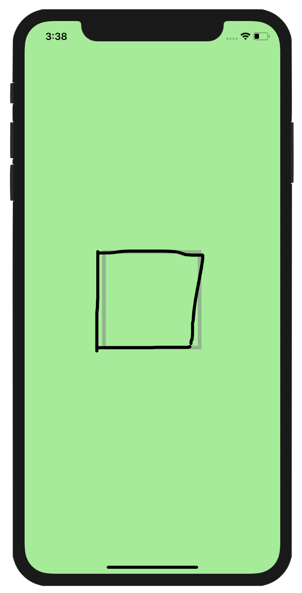

> The *Kanji Trainer* is an iOs and Android application that I created to help teach stroke order for Japanese characters.

*Coming to the play store soon!*

First, some context. Since 2018, I have been teaching myself Japanese as a hobby. I noticed that there are many tools that help with reading, listening, and speaking. Teaching Japanese writing, however, is still relegated to more traditional methods such as rote memorization. While this certainly works, it tends to be inefficient as a pen and paper is required to practice this way, and a teacher is often needed to correct mistakes.

This is where my application comes in. It uses AI and Euclidean distance algorithms to detect whether a character is written correctly. It can then give the user real-time feedback on where to improve.

###Technology stack
- React Native
- AWS
- Tensorflow
- Flask