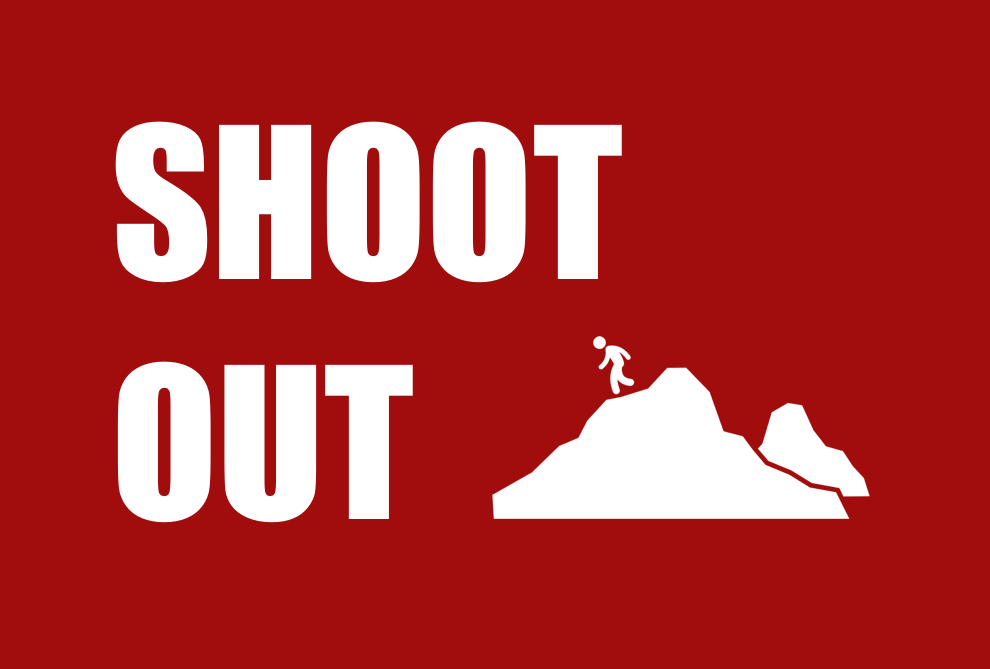

Shootout is a top-down shooter game that I programmed during a pre-collegiate summer course at Stanford University.

###Inspiration
The game itself takes inspiration from other top-down shooter games that I have played–most notably, games like Hotline Miami and the Binding of Isaac. I wanted to replicate interesting aspects of projectile physics from both games, and I feel like I have been able to do so with the current version.

###Technology stack
- Lue
- Love2D
- Tiled

####[Go check out the project on GitHub!](https://github.com/arjoooooon)